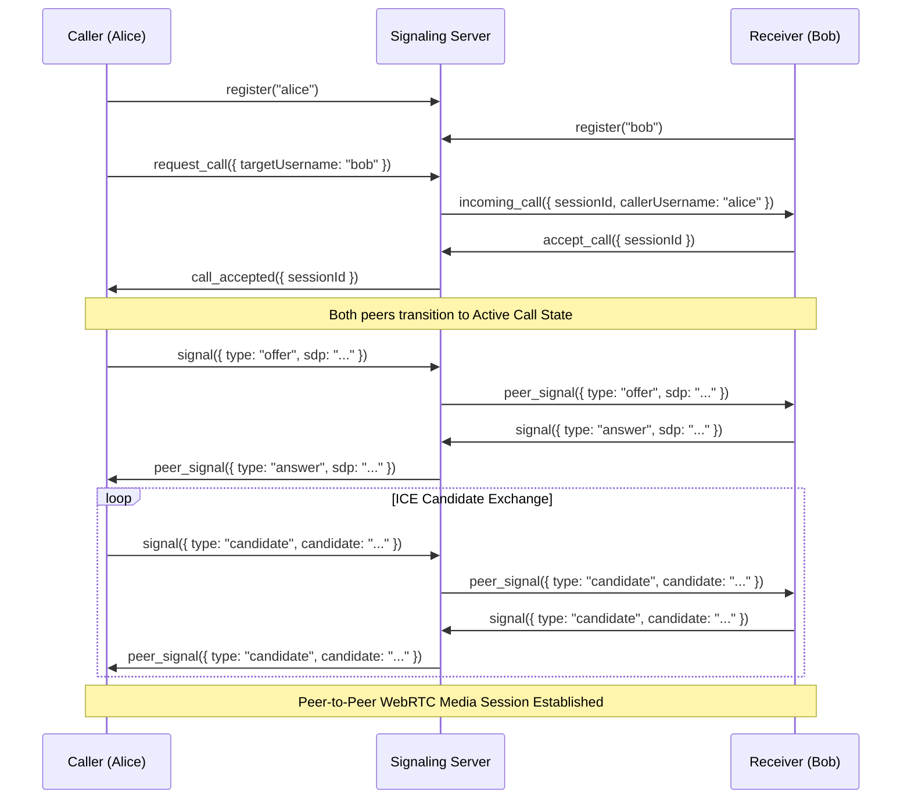

# Swaply Video Calling Platform — Developer API & Event Reference

This reference documents the REST HTTP API endpoints, Socket.io real-time event definitions, and WebRTC signaling handshake sequences.

---

## 1. REST HTTP API Reference

All requests and responses use JSON. Unauthenticated routes do not require any headers. Authenticated routes require an `Authorization` header:

```http
Authorization: Bearer <jwt_access_token>
```

### 1.1 Authentication Endpoints

#### `POST /api/auth/register`
Creates a new user account.
- **Request Body**:
  ```json
  {
    "username": "alice",
    "password": "secure_password_123"
  }
  ```
- **Response (201 Created)**:
  ```json
  {
    "success": true,
    "message": "User registered successfully",
    "userId": 1
  }
  ```

#### `POST /api/auth/login`
Authenticates a user and returns JWT tokens.
- **Request Body**:
  ```json
  {
    "username": "alice",
    "password": "secure_password_123"
  }
  ```
- **Response (200 OK)** (sets a `refreshToken` HTTP-only cookie):
  ```json
  {
    "success": true,
    "accessToken": "eyJhbGciOi...",
    "user": {
      "id": 1,
      "username": "alice"
    }
  }
  ```

#### `POST /api/auth/refresh`
Refreshes an expired access token using the refresh token cookie.
- **Request Body**: None (requires `refreshToken` cookie)
- **Response (200 OK)**:
  ```json
  {
    "success": true,
    "accessToken": "new_eyJhbGciOi..."
  }
  ```

#### `POST /api/auth/logout`
Clears the refresh token cookie and logs the user out.
- **Response (200 OK)**:
  ```json
  {
    "success": true,
    "message": "Logged out successfully"
  }
  ```

#### `GET /api/auth/me` *(Authenticated)*
Retrieves current user details from JWT.
- **Response (200 OK)**:
  ```json
  {
    "success": true,
    "user": {
      "id": 1,
      "username": "alice"
    }
  }
  ```

---

### 1.2 Call Operations Endpoints

#### `POST /api/calls/feedback` *(Authenticated)*
Submits calling quality rating and checkbox issues list.
- **Request Body**:
  ```json
  {
    "callId": "d040854d-cb7f-4424-9b2f-37651a54b34b",
    "rating": 5,
    "issues": ["audio"],
    "comments": "Great clarity!"
  }
  ```
- **Response (200 OK)**:
  ```json
  {
    "success": true,
    "message": "Feedback saved"
  }
  ```

#### `GET /api/calls/history` *(Authenticated)*
Retrieves the logged call sessions, supports query filters.
- **Query Parameters**:
  - `filter`: `all`, `incoming`, `outgoing`, `missed`, `rejected`
  - `quality`: `Excellent`, `Good`, `Fair`, `Poor`, `Critical`
- **Response (200 OK)**:
  ```json
  {
    "success": true,
    "history": [
      {
        "id": "d040854d-cb7f-4424-9b2f-37651a54b34b",
        "caller": "alice",
        "receiver": "bob",
        "status": "completed",
        "duration": 45,
        "rating": 5,
        "created_at": "2026-07-30T12:00:00Z"
      }
    ]
  }
  ```

---

### 1.3 System Telemetry Endpoints

#### `GET /api/health`
Returns system status diagnostics, CPU, memory, and database pool capacity.
- **Response (200 OK)**:
  ```json
  {
    "status": "UP",
    "timestamp": "2026-07-30T21:20:00Z",
    "uptime": "2h 15m 12s",
    "process": {
      "cpuUsage": { "user": 12000, "system": 34000 },
      "memoryUsage": { "rss": 94371840, "heapUsed": 45097152 }
    },
    "db": {
      "totalConnections": 10,
      "idleConnections": 9,
      "waitingQueries": 0
    }
  }
  ```

---

## 2. Socket.io Event Definitions

### 2.1 Client to Server Messages
- `register(username, callback)`: Associate socket ID with a username.
- `request_call({ targetUsername, mode }, callback)`: Initiates a call ring to peer.
- `accept_call({ sessionId })`: Accept incoming ring invitation.
- `reject_call({ sessionId })`: Reject incoming ring invitation.
- `cancel_call({ sessionId })`: Terminate outgoing ring invitation before peer answers.
- `signal({ sessionId, sdp, candidate, type })`: Relay SDP offer/answer or ICE candidate.
- `video_state_changed({ sessionId, videoOff })`: Informs peer that video track is toggled.
- `presence_status({ status })`: Sets manual availability (`online`, `away`, `busy`).
- `send_message({ sessionId, text })`: Transmits chat message during call.

### 2.2 Server to Client Notifications
- `incoming_call({ sessionId, callerUsername, mode })`: Renders calling notification box.
- `call_accepted({ sessionId })`: Notifies caller to start ICE gathering.
- `call_rejected({ sessionId })`: Closes the caller ring CRT overlay.
- `call_cancelled({ sessionId })`: Hides incoming ring overlay.
- `peer_signal({ sdp, candidate, type })`: Delivers offer, answer, or candidate payload.
- `video_state_changed({ videoOff })`: Notifies peer client to display placeholder image.
- `presence_update({ username, status, lastSeen })`: Updates dashboard contacts listings.
- `receive_message({ sender, text, timestamp })`: Appends chat message to drawer overlay.
- `error(message)`: Real-time throttle alert or validation error.

---

## 3. WebRTC Signaling Flow Diagram


